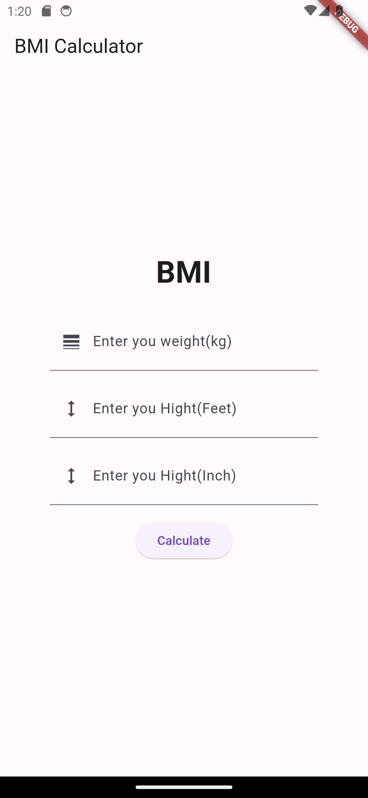
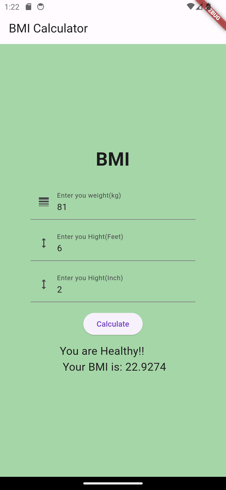
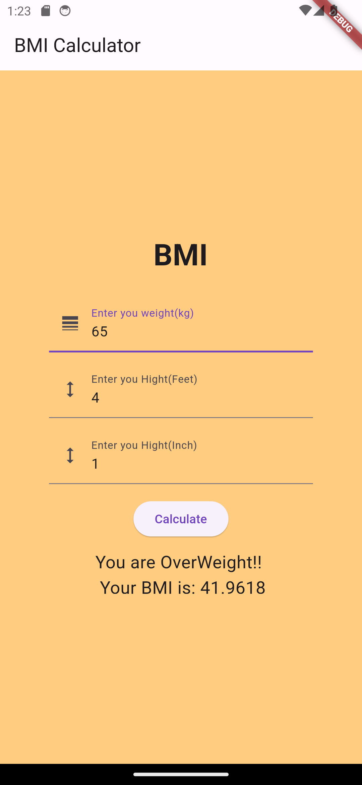
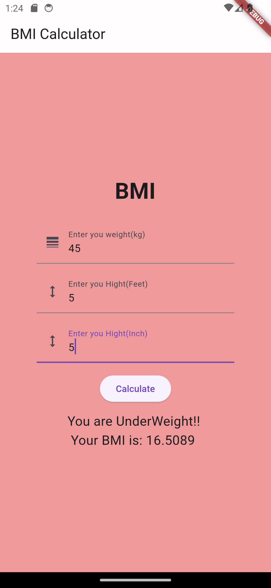

# BMI Calculator App

This is a simple BMI (Body Mass Index) calculator app built with Flutter. The app allows users to calculate their BMI based on their weight in kilograms and height in feet and inches. It also provides a color-coded result indicating whether the user is underweight, overweight, or within a healthy weight range.
Download [Click here](https://github.com/Nakib00/BMI_Calculator/blob/main/Final%20apps/app-release.apk)

## Screenshots

![Screenshot 1]
![Screenshot 2]
![Screenshot 3]
![Screenshot 4]
![Screenshot 5]

## Features

- Calculate BMI based on weight and height inputs
- Display the BMI result with a color-coded indication
- Error handling for empty input fields
- User-friendly interface with clear instructions

## How to Use

1. Enter your weight in kilograms in the "Enter your weight(kg)" text field.
2. Enter your height in feet in the "Enter your Height(Feet)" text field.
3. Enter your height in inches in the "Enter your Height(Inch)" text field.
4. Click the "Calculate" button to calculate your BMI.
5. The app will display your BMI along with a message indicating whether you are underweight, overweight, or within a healthy weight range.

## License

This project is licensed under the Md Nakibul isalm.
